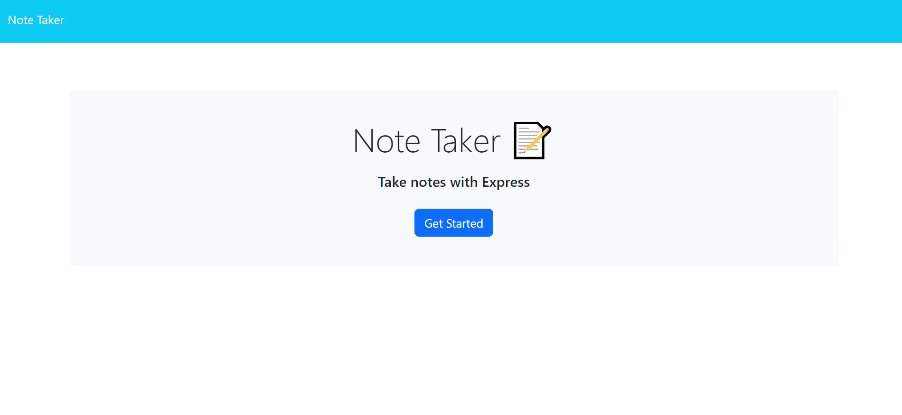
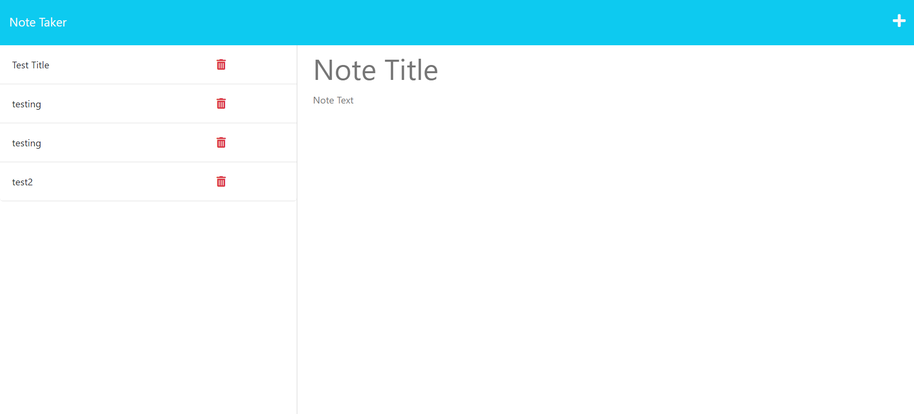

  # Note Taker 

  ## License: N/A
  

  ## Description:
  ### Note Taker is an application that can be used to write and save notes. This application will use an Express.js back end and will save and retrieve note data from a JSON file.

  ## Table of Contents
  ### * [License](#license)
  ### * [Installation](#installation)
  ### * [Assets](#assets)
  ### * [Usage](#usage)
  ### * [Contributing](#contributing)
  ### * [Tests](#tests)
  ### * [Questions](#questions)

  ## Installation:
  ### You must Install the following for this application to function:
  ### Node.JS Version 16.18.1
  ### Heroku

  ## Assets:
  ### The following image demonstrates the web application's appearance and functionality:

 

 
 

  ### Link for application https://pacific-mesa-04834.herokuapp.com/ 

  ## Usage:
  ### Users needing to take notes and save them.

  ## Contributing:
  ### N/A

  ## Tests:
  ### N/A

  ## Questions:
  ### If you have any questions, contact me at
  ### GitHub: https://github.com/JerrickJohnson
  ### or
  ### Email: jerrickjohnson88@gmail.com
